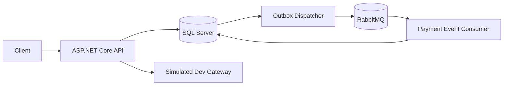

# EcommerceTxPr

A reliability-focused .NET 8 e-commerce backend demonstrating transactional consistency, recoverable payment processing, optimistic concurrency, Outbox/Inbox messaging, RabbitMQ, SQL Server, Docker, and CI.

[](https://github.com/LeonardoFernandesContrera/EcommerceTxPr/actions/workflows/ci.yml)
[](https://dotnet.microsoft.com/download/dotnet/8.0)
[](LICENSE.txt)

**323 automated tests | Release build: 0 errors / 0 warnings | CI quality and production smoke validation**

EcommerceTxPr is an architecture and backend-engineering portfolio project, not a commercial storefront. Its focus is the difficult part of stateful APIs: preserving business intent when requests repeat, writes race, a payment result is uncertain, or a message broker is temporarily unavailable.

## Why This Project Exists

A normal synchronous implementation works while every dependency responds once and in order. This project asks what happens outside that happy path:

- What if the same order request arrives twice?
- What if two orders update the same inventory concurrently?
- What if a payment provider succeeds but the final local save fails?
- What if SQL commits while RabbitMQ is offline?
- What if RabbitMQ delivers the same event again?

The current design answers those questions inside a modular monolith. It keeps code boundaries explicit without introducing artificial services, and it documents where each guarantee ends.

## Key Engineering Highlights

### HTTP idempotency

Order creation requires one `Idempotency-Key` header. HTTP header names are case-insensitive; the key value is treated as exact and case-sensitive, stored through its hash, and associated with a canonical logical request fingerprint.

The first successful order returns `201 Created`. The same key with an equivalent logical request returns the persisted Order with `200 OK`; reusing that key for a different logical request returns `409 Conflict`. Product lines are aggregated and canonically ordered, so harmless line ordering or quantity splitting does not change request identity.

### Optimistic concurrency

Inventory uses an application-managed Product version token. Concurrent requests cannot silently overwrite one another's stock changes: the losing write becomes an explicit conflict.

Payment terminal transitions use `Payment.Status` as the concurrency token. The business transition from `Pending` to `Succeeded` or `Failed` is also the concurrency change, so two terminal updates cannot both commit.

### Durable payment intent and provider idempotency

Payment itself is the durable intent:

```text
commit Payment(Pending)
-> derive a stable provider key from PaymentId
-> call the payment gateway
-> commit terminal local state
```

If the provider succeeds but the final database save fails, a later request loads the same `Pending` Payment and calls the provider with the same key. A provider that honors idempotent replay returns the original result instead of repeating the external effect. Provider idempotency protects that external effect; EF concurrency separately protects local terminal persistence.

### Transactional Outbox

Payment terminal state, Order state, and the Outbox message derived from the in-memory Domain Event commit in one local SQL transaction. The Domain Event is the mapping source; the Outbox representation is the durable row.

The Outbox dispatcher publishes committed messages later. RabbitMQ can therefore be temporarily unavailable without turning the original SQL write into an unsafe database/broker dual-write.

### At-least-once messaging and Inbox processing

Publication uses mandatory routing and publisher confirms. Consumption uses manual acknowledgements, prefetch one, and a durable Inbox identity. Inbox and `PaymentEventProjection` changes commit together, so a repeated delivery does not repeat the projection effect.

This is at-least-once delivery with idempotent consumer processing, not exactly-once messaging. Duplicate publication and delivery remain expected outcomes.

## Reliability Guarantees

| Problem | Mechanism | Boundary |
| --- | --- | --- |
| Duplicate order POST | Hashed exact key value and canonical request fingerprint | Equivalent logical request replays; different logical reuse returns `409` |
| Concurrent inventory update | Application-managed Product version token | The losing update becomes a concurrency conflict |
| Provider response is lost or final local save fails | Durable `Pending` Payment and stable provider idempotency key | The provider must honor equivalent idempotent retries |
| Concurrent terminal payment update | `Payment.Status` concurrency token | Only one `Pending`-to-terminal local transition commits |
| SQL commits while the broker is offline | Transactional Outbox | Event intent is durable locally and is published later |
| Publish is unconfirmed or unroutable | Keep the Outbox row pending | A later polling cycle retries publication |
| RabbitMQ redelivers | Inbox `MessageId` deduplication | The projection is idempotent; transport remains at least once |
| Inbox identity is reused with a different Type | Treat the delivery as poison | Inconsistent identity is rejected rather than replayed |

## Architecture



The repository is a modular monolith, not a microservices architecture. SQL Server is the local transactional boundary; the payment gateway and RabbitMQ are external dependency boundaries with different recovery models.

Detailed documentation:

- [System overview](docs/architecture/system-overview.md)
- [Payment reliability](docs/architecture/payment-reliability.md)
- [Messaging reliability](docs/architecture/messaging-reliability.md)
- [Architecture decisions](docs/architecture/decisions.md)

## Quick Start

The primary local path requires only Docker Engine or Docker Desktop with Docker Compose. `.env.example` contains local-development values; copy it to the ignored `.env` file before starting the stack.

Linux/macOS:

```bash
git clone https://github.com/LeonardoFernandesContrera/EcommerceTxPr.git
cd EcommerceTxPr
cp .env.example .env
docker compose up --build
```

PowerShell:

```powershell
git clone https://github.com/LeonardoFernandesContrera/EcommerceTxPr.git
Set-Location EcommerceTxPr
Copy-Item .env.example .env
docker compose up --build
```

| Service | URL |
| --- | --- |
| API | <http://localhost:8080> |
| Swagger | <http://localhost:8080/swagger> |
| Full dependency health | <http://localhost:8080/health> |
| Liveness | <http://localhost:8080/health/live> |
| Readiness | <http://localhost:8080/health/ready> |
| RabbitMQ Management | <http://localhost:15673> |

Stop the stack with `docker compose down`. Add `--volumes` only when intentionally deleting the local SQL Server and RabbitMQ data volumes.

### Startup behavior

Compose starts SQL Server and waits for it to become healthy. `EcommerceTxPr.DbMigrator` then applies the EF Core migrations, and the API starts only after migration success. RabbitMQ runs independently of that SQL/migrator chain.

RabbitMQ configuration is validated during startup, but publisher and consumer connections are established lazily. If a correctly configured broker is temporarily unavailable, the API process can still start and database-backed requests can commit. Pending Outbox messages wait for later dispatcher polling cycles. This separation does not mean every broker-dependent effect is available indefinitely; asynchronous propagation is delayed until RabbitMQ recovers.

### Health model

- `/health/live` checks the application process only.
- `/health/ready` checks the primary SQL database.
- `/health` reports SQL Server and RabbitMQ dependency status.
- RabbitMQ unavailable makes root health `Degraded` while `/health` remains HTTP `200`.
- SQL Server unavailable makes the relevant health result `Unhealthy` and returns HTTP `503`.

## API Walkthrough

The following flow uses the actual controllers and request contracts. The application itself does not require `jq`; it is used here only to keep the Unix-style shell examples executable and to capture server-generated IDs. The same IDs can be copied manually from the JSON responses.

```bash
API_URL=http://localhost:8080

# 1. Create a customer -> 201 Created
CUSTOMER_JSON=$(curl --fail-with-body --silent --show-error \
  --request POST "$API_URL/api/customers" \
  --header 'Content-Type: application/json' \
  --data '{"name":"Ada Lovelace","birthDate":"1990-12-10"}')
CUSTOMER_ID=$(jq --raw-output '.id' <<<"$CUSTOMER_JSON")
jq . <<<"$CUSTOMER_JSON"

# 2. Create a stocked product -> 201 Created
SKU="PORTFOLIO-$(date +%s)-$RANDOM"
PRODUCT_JSON=$(curl --fail-with-body --silent --show-error \
  --request POST "$API_URL/api/products" \
  --header 'Content-Type: application/json' \
  --data "{\"sku\":\"$SKU\",\"name\":\"Mechanical Keyboard\",\"price\":125.50,\"stockQuantity\":10}")
PRODUCT_ID=$(jq --raw-output '.id' <<<"$PRODUCT_JSON")
jq . <<<"$PRODUCT_JSON"

# 3. Build one logical order request
ORDER_REQUEST=$(jq --null-input \
  --arg customerId "$CUSTOMER_ID" \
  --arg productId "$PRODUCT_ID" \
  '{customerId:$customerId,items:[{productId:$productId,quantity:2}]}')
IDEMPOTENCY_KEY="portfolio-order-$(date +%s)-$RANDOM"

# 4. Place the order for the first time -> 201 Created
ORDER_JSON=$(curl --fail-with-body --silent --show-error \
  --request POST "$API_URL/api/orders" \
  --header 'Content-Type: application/json' \
  --header "Idempotency-Key: $IDEMPOTENCY_KEY" \
  --data "$ORDER_REQUEST")
ORDER_ID=$(jq --raw-output '.id' <<<"$ORDER_JSON")
jq . <<<"$ORDER_JSON"

# 5. Replay the equivalent request -> 200 OK, same Order identity
curl --include --silent --show-error \
  --request POST "$API_URL/api/orders" \
  --header 'Content-Type: application/json' \
  --header "Idempotency-Key: $IDEMPOTENCY_KEY" \
  --data "$ORDER_REQUEST"

# 6. Process payment; no request body -> 201 Created on first completion
curl --include --silent --show-error \
  --request POST "$API_URL/api/orders/$ORDER_ID/payments"

# 7. Retrieve the payment -> 200 OK
curl --fail-with-body --silent --show-error \
  "$API_URL/api/orders/$ORDER_ID/payment" | jq .

# 8. Retrieve the now-paid order -> 200 OK
curl --fail-with-body --silent --show-error \
  "$API_URL/api/orders/$ORDER_ID" | jq .
```

The response bodies use these shapes:

- Customer: `id`, `name`, `birthDate`, `creationDate`.
- Product: `id`, `sku`, `name`, `price`, `stockQuantity`, `creationDate`.
- Order: `id`, `customerId`, `status`, `creationDate`, `total`, `items`.
- Order item: `productId`, `productName`, `unitPrice`, `quantity`, `lineTotal`.
- Payment: `id`, `orderId`, `amount`, `status`, `creationDate`, `providerReference`, `failureCode`.

### Idempotency conflict

Repeating the same key and equivalent order body returns `200 OK`. Reordered product lines and split duplicate quantities are also equivalent when their customer, products, and aggregate quantities match.

Changing the logical quantity while keeping the key returns `409 Conflict`:

```bash
CONFLICTING_ORDER_REQUEST=$(jq --null-input \
  --arg customerId "$CUSTOMER_ID" \
  --arg productId "$PRODUCT_ID" \
  '{customerId:$customerId,items:[{productId:$productId,quantity:3}]}')

# Same key, different logical quantity -> 409 Conflict
curl --include --silent --show-error \
  --request POST "$API_URL/api/orders" \
  --header 'Content-Type: application/json' \
  --header "Idempotency-Key: $IDEMPOTENCY_KEY" \
  --data "$CONFLICTING_ORDER_REQUEST"
```

The Problem Details response includes code `Order.IdempotencyKeyConflict`.

### Payment trust and retry boundary

`POST /api/orders/{orderId}/payments` has no request body. The client cannot choose Payment ID, amount, provider idempotency key, simulated gateway outcome, provider reference, or failure code.

Actual HTTP behavior:

- first completed processing returns `201 Created`;
- resumed processing or terminal replay returns `200 OK`;
- an indeterminate gateway result returns `503 Service Unavailable` with code `Payment.OutcomeIndeterminate`;
- `GET /api/orders/{orderId}/payment` returns `200 OK` after the Payment intent exists.

An indeterminate result leaves Payment and Order `Pending` with no terminal Outbox event. Retrying the same POST reuses the existing Payment ID, amount, and provider key. See [Payment reliability](docs/architecture/payment-reliability.md) for the complete lost-response and failed-final-save sequence.

## Project Structure

| Project | Responsibility |
| --- | --- |
| `EcommerceApi.V2` | HTTP controllers, Problem Details, Swagger, health endpoints, and process composition |
| `EcommerceTxPr.Application` | Use cases, contracts, ports, and reliability orchestration |
| `EcommerceTxPr.Domain` | Entities, invariants, statuses, and Payment domain events |
| `EcommerceTxPr.Infrastructure` | EF Core, migrations, Outbox/Inbox mapping, RabbitMQ adapters/workers, and simulated gateway |
| `EcommerceTxPr.DbMigrator` | Dedicated EF Core migration executable used before API startup |
| `EcommerceTxPr.UnitTests` | Fast domain and application tests with handwritten deterministic doubles |
| `EcommerceTxPr.IntegrationTests` | API, persistence, concurrency, payment, messaging, consumer lifecycle, and health tests |

## Technology

- **Backend:** .NET 8, ASP.NET Core, C#.
- **Persistence:** EF Core 8, SQL Server, and SQLite for isolated integration tests.
- **Messaging:** RabbitMQ.Client 7 and RabbitMQ.
- **Infrastructure:** Docker, Docker Compose, and GitHub Actions.
- **Testing:** xUnit, ASP.NET Core `WebApplicationFactory`, and handwritten deterministic test doubles.

## Testing

The verified suite contains **136 unit tests and 187 integration tests: 323 passed, 0 failed, 0 skipped**.

The tests cover domain invariants, application services, API semantics, order idempotency, optimistic inventory and payment concurrency, durable payment recovery, Outbox mapping and atomicity, RabbitMQ publisher outcomes, Inbox idempotency, manual acknowledgement and consumer-session lifecycle, health endpoints, and SQLite persistence.

The GitHub Actions production smoke job separately validates the real SQL Server and RabbitMQ path: container startup, migrations, health, broker topology, and SQL-backed customer persistence. No code-coverage percentage is claimed because the repository does not currently publish one.

## Continuous Integration

The [CI workflow](https://github.com/LeonardoFernandesContrera/EcommerceTxPr/actions/workflows/ci.yml) contains two jobs:

- **Quality** restores local tools and packages, builds Release with warnings as errors, runs the complete tests, checks EF migration drift, and audits vulnerable packages.
- **Production smoke** validates Compose, builds the API and migrator images, starts SQL Server and RabbitMQ, applies migrations, checks health and topology, and exercises SQL-backed API persistence.

## Known Limitations

These are deliberate scope boundaries rather than hidden claims:

- no authentication or authorization;
- deterministic simulated Development payment provider only;
- no provider webhook or automatic `Pending` Payment reconciliation worker;
- one Payment operation per Order, without multiple payment methods or refunds;
- no retry exchange, delayed-message plugin, or dead-letter queue topology;
- no automated Inbox or Outbox retention cleanup;
- no production observability platform or cloud deployment;
- single-node RabbitMQ for local development;
- SQL Server Developer edition in the local Compose environment.

## Future Work

Reasonable extensions include a real provider adapter with webhooks and reconciliation, explicit broker retry/dead-letter policy, Inbox/Outbox retention jobs, authentication and authorization, production telemetry, and deployment to a real target. Those concerns are intentionally outside the current repository.

## License

This project is available under the [MIT License](LICENSE.txt).
