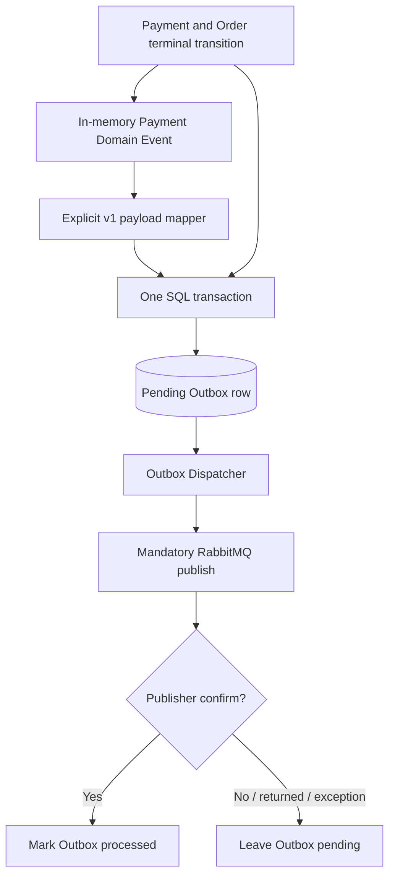
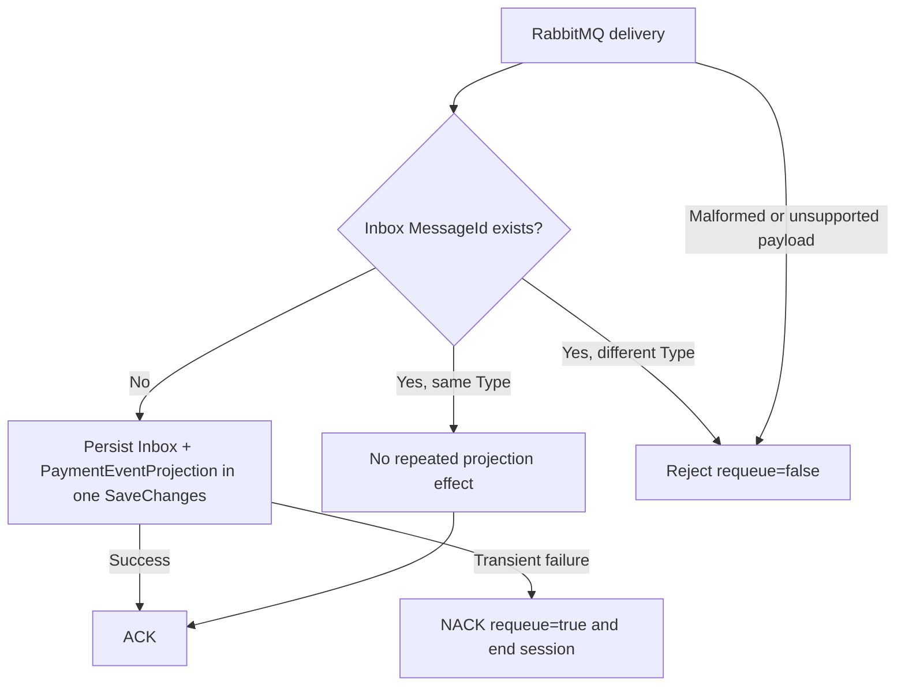

# Messaging Reliability

**This system uses at-least-once delivery with idempotent consumer processing. It does not provide exactly-once messaging.**

The Outbox protects the boundary between a committed SQL transaction and later RabbitMQ publication. The Inbox protects the consumer's local effect when a message is delivered more than once. Both patterns make duplicates safe; neither removes duplicates from the transport.

## Guarantee

The end-to-end guarantee is:

```text
business transition and event intent commit locally
-> confirmed publication is retried until recorded
-> RabbitMQ may deliver one or more times
-> consumer effect is committed once per MessageId and Type
```

SQL Server is authoritative for pending Outbox work and processed Inbox identities. There is no in-memory "already published" or "already consumed" state used as a substitute for those durable records.

## Producer Transaction

Payment terminal transitions raise an in-memory Domain Event. Infrastructure maps every known event to a stable integration contract before calling `SaveChangesAsync`:



The stable integration types are:

- `payment.succeeded.v1`, serialized from an explicit `PaymentSucceededV1Payload`;
- `payment.failed.v1`, serialized from an explicit `PaymentFailedV1Payload`.

The mapper does not blindly serialize the internal Domain Event object. An internal property change therefore does not automatically mutate an existing v1 payload contract. The event's `OccurredOnUtc` is created when the business transition raises the event, not later during Outbox mapping.

The unit of work snapshots all tracked domain events and maps all of them before persistence. If any event type is unknown, or mapping/serialization fails, the operation fails closed: `SaveChangesAsync` is not called and the in-memory events are not cleared.

When mapping succeeds, Payment terminal state, Order state, and the Outbox message derived from the in-memory event enter one EF Core `SaveChangesAsync` call and one local SQL transaction. Domain events are cleared only after that save succeeds. A known persistence conflict clears the losing change tracker, and none of its business mutations or Outbox rows commit.

## Confirmed Publication

The Outbox dispatcher polls SQL Server for pending rows in configured batches. RabbitMQ configuration is validated at startup, but connection and topology establishment are lazy. A valid configuration pointing to a temporarily unavailable broker does not prevent the API from starting.

On the first usable connection/channel, the shared topology declares the durable exchange, payment-events queue, and bindings. The same topology definition is used by publisher and consumer so their routing assumptions stay aligned.

Publication uses:

- a long-lived connection/channel after successful establishment;
- mandatory routing;
- RabbitMQ publisher confirms;
- the Outbox Message ID as the stable message identity;
- the explicit Outbox Type as the routing/integration type.

One dispatcher cycle does not run a nested aggressive retry loop. It attempts connection or publication, records/logs a failure category without credentials or unnecessary payload data, and returns. The configured polling interval supplies the next attempt.

Every one of these outcomes leaves the Outbox row pending:

- connection creation fails;
- topology declaration fails;
- channel creation fails;
- publish throws;
- the publisher confirmation is negative;
- mandatory publication is returned as unroutable;
- persistence of the processed marker fails.

Only a tracked publish that completes successfully is treated as confirmed. After confirmation, the dispatcher sets `ProcessedOnUtc` and saves that marker. This ordering creates an intentional at-least-once window: RabbitMQ may have the message even if saving `ProcessedOnUtc` fails.

## Consumer Processing

The consumer uses manual acknowledgements with `autoAck: false`, prefetch one, and `ConsumerDispatchConcurrency = 1`. It copies the delivery body before the RabbitMQ callback returns, then passes the owned bytes to the application processor.



The processing outcomes map to broker actions as follows:

| Processor outcome | Broker action | Reason |
| --- | --- | --- |
| Processed | ACK | Inbox and projection committed |
| Duplicate | ACK | Matching Inbox identity already represents the effect |
| Poison | reject, `requeue=false` | Malformed, unsupported, or inconsistent identity must not loop |
| Transient failure | NACK, `requeue=true` | Delivery remains available for a later session |

After a transient failure, the current consumer session ends. The BackgroundService disposes it, waits `ConsumerReconnectDelaySeconds`, and creates a new session. This prevents an immediately redelivered message from creating a tight hot-requeue loop. Broker-side cancellation/unregistration, channel shutdown, connection shutdown, and callback exceptions also complete the session so the same reconnect lifecycle can replace it.

## Duplicate Delivery

The Inbox primary key is the stable RabbitMQ `MessageId`. Before applying the projection, the processor checks that identity:

```text
MessageId absent
-> create Inbox row
-> apply PaymentEventProjection
-> persist both with exactly one SaveChangesAsync

MessageId present and stored Type equals incoming Type
-> Duplicate
-> no repeated projection effect
-> ACK

MessageId present but stored Type differs from incoming Type
-> Poison / inconsistent identity
-> reject with requeue=false
```

Phase 11 deliberately does not add payload hashing. Identity plus Type is the current integrity boundary.

`PaymentEventProjection` is an audit-oriented local effect, not a new payment, fulfillment, invoice, or email domain. Inbox and projection changes commit atomically, so a database failure cannot persist one without the other.

## Failure Outcomes

Duplicate publication and delivery remain possible even when every component behaves correctly. Consider this sequence:

1. RabbitMQ accepts and confirms a publication.
2. Saving the Outbox `ProcessedOnUtc` marker fails.
3. The row remains pending in SQL Server.
4. A later dispatcher cycle publishes it again.
5. The consumer finds the existing Inbox identity and acknowledges the duplicate without repeating the projection.

Similarly, a consumer can commit Inbox and projection state but lose its connection before the ACK reaches RabbitMQ. Redelivery then follows the same duplicate path.

These are expected at-least-once outcomes, not conditions hidden by an exactly-once claim.

## Boundaries

- Publisher confirms establish broker acceptance for a publish; they do not atomically commit the later SQL processed marker.
- Manual ACK occurs after local consumer persistence, but the ACK itself is not part of the SQL transaction.
- Inbox deduplication makes this repository's projection effect idempotent; other future consumers would need their own idempotency strategy.
- There is no retry exchange, delayed-message plugin, dead-letter queue topology, MassTransit, Polly, or in-memory published-message registry.
- Outbox and Inbox retention cleanup is not implemented.
- Broker availability is not application liveness or SQL readiness, although root dependency health reports RabbitMQ as `Degraded` when unavailable.
