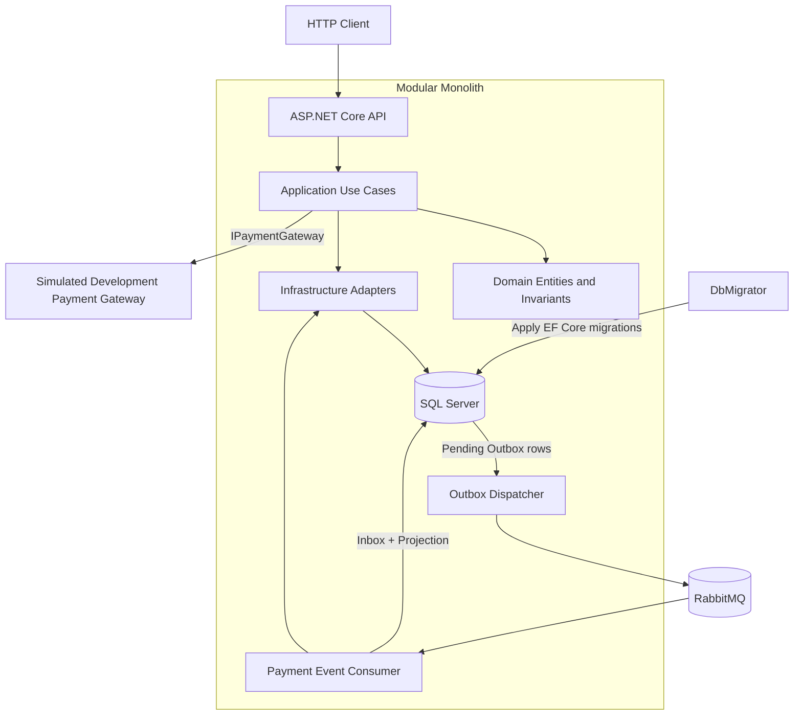

# System Overview

EcommerceTxPr is a modular monolith: one deployable ASP.NET Core application with explicit API, Application, Domain, and Infrastructure project boundaries. The repository demonstrates reliability patterns without inventing independently deployed microservices or network boundaries that the current problem does not require.

## Architecture at a Glance



The payment gateway box marks the boundary where a real external provider adapter could be introduced. The checked-in implementation is explicitly a deterministic simulated Development gateway; it is not presented as a production payment integration.

## Module Responsibilities

- **`EcommerceApi.V2`** exposes HTTP controllers, translates application errors into Problem Details, publishes Swagger in Development, defines health endpoints, and composes the process.
- **`EcommerceTxPr.Application`** coordinates customer, product, order, and payment use cases. It owns service contracts and ports for repositories, the unit of work, and the payment gateway.
- **`EcommerceTxPr.Domain`** owns entities, state transitions, invariants, statuses, and the in-memory Payment domain events raised by terminal payment transitions.
- **`EcommerceTxPr.Infrastructure`** implements EF Core persistence, SQL Server error classification, migrations, Outbox and Inbox mapping, RabbitMQ publishing and consumption, background workers, and the simulated Development gateway.
- **`EcommerceTxPr.DbMigrator`** is a dedicated executable that applies EF Core migrations before the API starts in the Compose environment.
- **`EcommerceTxPr.UnitTests`** exercises domain and application behavior with handwritten deterministic test doubles.
- **`EcommerceTxPr.IntegrationTests`** exercises HTTP, persistence, concurrency, messaging, consumer lifecycle, health, and recovery behavior through the composed application.

These are code and dependency boundaries inside one application. They allow business rules and orchestration to remain independent of HTTP, EF Core, RabbitMQ, and the simulated gateway without claiming a microservices architecture.

## Request and Payment Boundaries

A normal database-backed request follows this path:

```text
HTTP request
-> controller
-> application service
-> domain operations and infrastructure ports
-> one local SQL transaction
```

Order placement validates and canonicalizes the request, checks the exact idempotency-key value through its hash, loads inventory, applies domain changes, and persists the Order, stock updates, and idempotency record together. Product version tokens protect inventory against lost concurrent updates.

Payment processing deliberately crosses a boundary that SQL Server cannot include in its transaction:

```text
Payment service
-> commit durable Payment(Pending)
-> IPaymentGateway
-> simulated Development adapter / provider boundary
-> local terminal transition
```

The committed `Pending` Payment is the recovery point. Its identity produces a stable provider idempotency key, while `Payment.Status` protects the later local `Pending`-to-terminal write with optimistic concurrency. Provider idempotency and local concurrency solve different failure modes.

## Messaging Path

Successful and failed Payment terminal transitions raise in-memory domain events. Infrastructure maps each known event to an explicit, versioned integration payload before saving:

```text
in-memory Domain Event
-> PaymentSucceededV1Payload or PaymentFailedV1Payload
-> JSON
-> durable Outbox row
```

The Domain Event is the in-memory mapping source. The Outbox row, including its stable message identity, integration type, serialized payload, and occurrence time, is the durable representation.

Payment terminal state, Order state, and the Outbox message derived from that event commit in the same local SQL transaction. A background dispatcher later reads pending Outbox rows and publishes them to RabbitMQ using mandatory routing and publisher confirms. RabbitMQ availability is therefore separated from the original business transaction.

The payment-event consumer receives with manual acknowledgements. Its processing path is:

```text
RabbitMQ delivery
-> validate envelope and payload
-> Inbox identity check
-> Inbox + PaymentEventProjection
-> one local SaveChanges
-> ACK
```

A delivery whose `MessageId` and Type already match an Inbox row is acknowledged without repeating the projection effect. A reused identity with a different Type is poison rather than a valid duplicate.

## Startup and Operational Boundaries

Docker Compose coordinates startup as follows:

1. SQL Server starts and passes its health check.
2. `EcommerceTxPr.DbMigrator` applies the EF Core migrations and exits.
3. The API starts only after the migrator completes successfully.
4. RabbitMQ runs independently of the SQL/migrator dependency chain.
5. The Outbox publisher and payment-event consumer establish RabbitMQ connections lazily and retry on later polling or reconnect cycles.

Valid RabbitMQ configuration is checked when the application starts, but a temporarily unavailable broker does not prevent the process from starting. Database-backed business requests can still commit locally, and Outbox rows remain pending until publication succeeds. This does not mean every feature is unaffected indefinitely; it means broker availability is not coupled to the original local transaction or API process startup.

The health endpoints reflect these boundaries:

- `/health/live` checks the application process;
- `/health/ready` checks the primary SQL database;
- `/health` reports SQL Server and RabbitMQ dependency status;
- RabbitMQ unavailability makes root health `Degraded` with HTTP `200`;
- SQL Server unavailability makes the relevant result `Unhealthy` with HTTP `503`.

## Guarantee Boundaries

- SQL Server provides atomicity for local state changes and their derived Outbox row.
- SQL Server and the payment provider do not participate in a distributed transaction.
- A stable provider idempotency key supports recoverable equivalent payment retries when the provider honors that contract.
- RabbitMQ publication and delivery are at least once, so duplicate publication and delivery remain possible.
- Inbox processing makes the local consumer projection idempotent; it does not make the transport exactly once.
- The simulated Development gateway is deterministic infrastructure for local development and tests, not a production payment provider.
