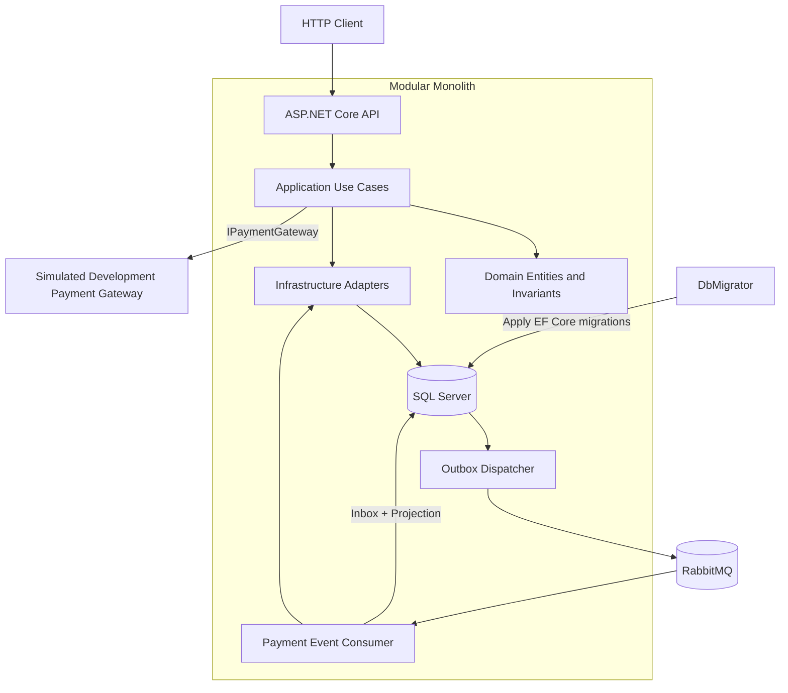
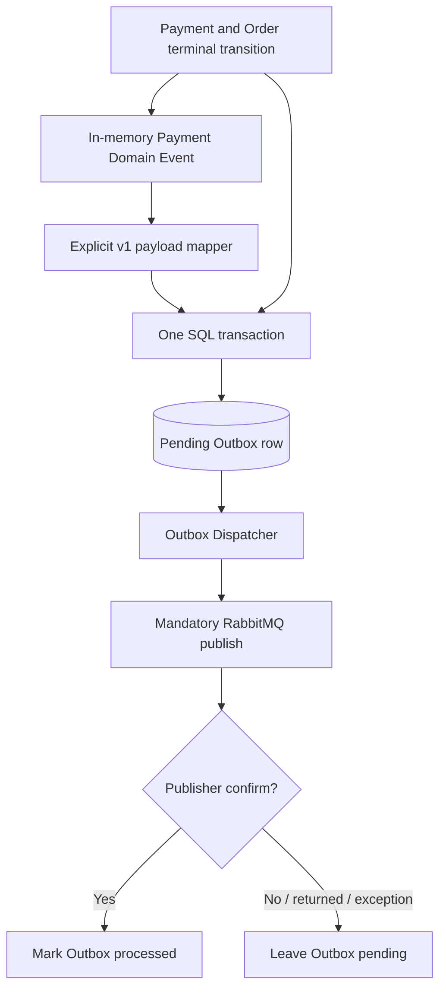
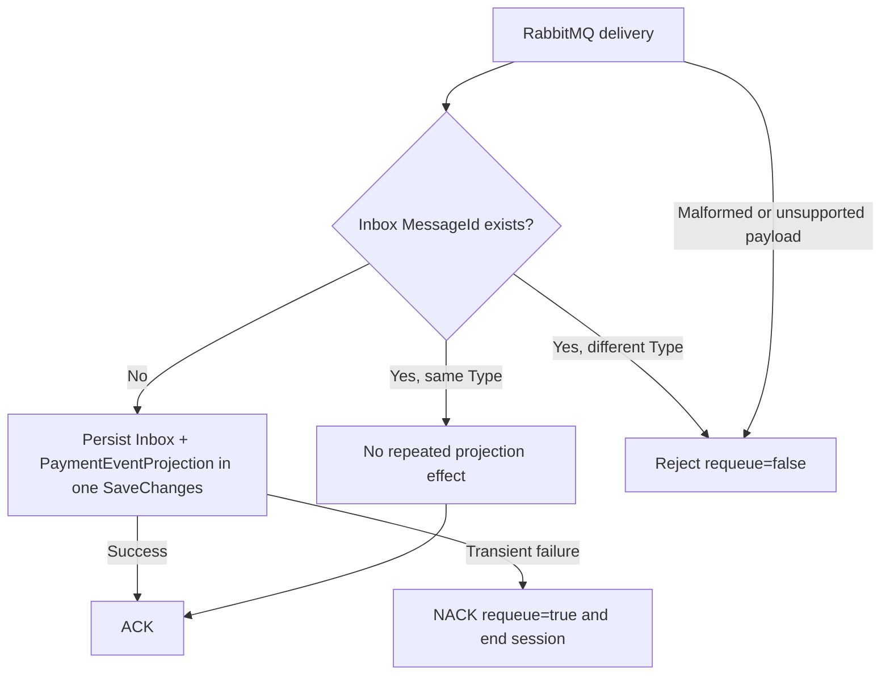
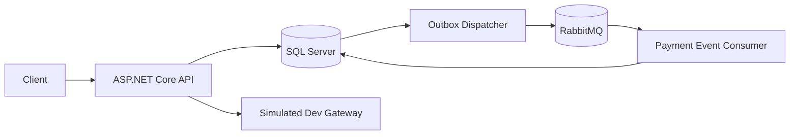

# Phase 14 Portfolio Presentation Implementation Plan

> **For agentic workers:** REQUIRED SUB-SKILL: Use superpowers:subagent-driven-development (recommended) or superpowers:executing-plans to implement this plan task-by-task. Steps use checkbox (`- [ ]`) syntax for tracking.

**Goal:** Replace the obsolete public presentation with a precise, executable, reliability-focused portfolio README and four focused architecture documents, while preserving application behavior and preparing a safe public-branch release.

**Architecture:** Keep the README as the compact public landing page and move detailed system, payment, messaging, and decision explanations into `docs/architecture`. Documentation must describe the existing modular monolith and its tested failure semantics without changing code. Public release readiness is verified separately from local repository completion.

**Tech Stack:** Markdown, Mermaid, Bash/curl/jq examples, PowerShell Quick Start alternative, Git, .NET 8 CLI, EF Core CLI, Docker Compose

**Spec:** `docs/superpowers/specs/2026-08-27-phase-14-portfolio-presentation-design.md`

## Global Constraints

- Phase 14 is documentation, presentation, hygiene, and release preparation only; stop and report any genuine application defect instead of fixing it silently.
- Do not add architecture, endpoints, dependencies, business behavior, infrastructure, or a Phase 15.
- Use professional English and keep `README.md` approximately 2,000–2,500 words.
- Keep the README Mermaid diagram compact; detailed flows belong in `docs/architecture`.
- Describe the system as a modular monolith, never as a microservices architecture.
- Describe RabbitMQ delivery as at least once with idempotent processing, never exactly once.
- Describe the payment gateway as deterministic simulated Development infrastructure, never a production provider.
- State that SQL Server and the payment provider do not share a distributed transaction.
- Distinguish the in-memory Domain Event from the durably persisted Outbox message derived from it.
- State that HTTP header names are case-insensitive; the `Idempotency-Key` value is treated as exact and case-sensitive.
- Keep Quick Start dependent only on Docker/Compose; `jq` is only a convenience for the API walkthrough.
- Preserve `refactor/foundation`; do not force-push, squash, rebase, or delete it.
- Do not claim public portfolio completion while the GitHub default branch still exposes the obsolete repository.
- Preserve the MIT license text except for the approved copyright line: `Copyright (c) 2024 Leonardo Fernandes Contrera`.
- Preserve the verified quality target: zero Release build errors/warnings, 136 unit tests, 187 integration tests, 323 total, zero failed, zero skipped.

## File map

- Create `docs/architecture/system-overview.md` — detailed component boundaries, deployment/startup roles, and synchronous/asynchronous flows.
- Create `docs/architecture/payment-reliability.md` — durable Payment intent, provider-idempotent retry, local concurrency, and failure recovery sequence.
- Create `docs/architecture/messaging-reliability.md` — transactional Outbox, publisher confirms, at-least-once delivery, manual acknowledgements, Inbox deduplication, and projection atomicity.
- Create `docs/architecture/decisions.md` — compact Context/Decision/Rationale/Trade-off log.
- Modify `README.md` — portfolio landing page, compact diagram, Quick Start, executable API walkthrough, test/CI evidence, limitations, and links.
- Modify `LICENSE.txt:3` — approved copyright line only.
- Preserve `Dockerfile`, `compose.yml`, application source, tests, and migrations unless the audit exposes a defect, in which case stop.

---

### Task 1: Add the system overview

**Files:**
- Create: `docs/architecture/system-overview.md`
- Include in first documentation commit: `docs/superpowers/specs/2026-08-27-phase-14-portfolio-presentation-design.md`
- Include in first documentation commit: `docs/superpowers/plans/2026-08-27-phase-14-portfolio-presentation.md`

**Interfaces:**
- Consumes: current project boundaries, `Program.cs`, `compose.yml`, Outbox/consumer registrations, and the approved specification.
- Produces: the README target `docs/architecture/system-overview.md` and the canonical component-level terminology used by the other documents.

- [ ] **Step 1: Create the architecture directory and system overview heading**

Create `docs/architecture/system-overview.md` with these sections in this order:

```markdown
# System Overview

## Architecture at a Glance

## Module Responsibilities

## Request and Payment Boundaries

## Messaging Path

## Startup and Operational Boundaries

## Guarantee Boundaries
```

The opening must identify the repository as one modular monolith with explicit project boundaries, not independently deployed microservices.

- [ ] **Step 2: Add the detailed Mermaid component diagram**

Use a top-to-bottom diagram based on this structure, adjusting only labels or line breaks for GitHub readability:



Explain that the gateway box represents an external-provider boundary but the checked-in adapter is simulated Development infrastructure.

- [ ] **Step 3: Document module responsibilities**

Give one focused paragraph or bullet per project:

```text
EcommerceApi.V2
EcommerceTxPr.Application
EcommerceTxPr.Domain
EcommerceTxPr.Infrastructure
EcommerceTxPr.DbMigrator
EcommerceTxPr.UnitTests
EcommerceTxPr.IntegrationTests
```

State the dependency intent without claiming a named architecture style the repository does not need: API exposes HTTP, Application coordinates use cases and ports, Domain owns state/invariants/events, and Infrastructure implements persistence, messaging, and gateway adapters.

- [ ] **Step 4: Document synchronous and asynchronous boundaries**

Cover these exact flows:

```text
HTTP request -> controller -> application service -> domain/infrastructure ports -> SQL transaction
Payment service -> IPaymentGateway -> simulated Development adapter
in-memory Domain Event -> explicit versioned payload mapping -> Outbox row
Outbox dispatcher -> RabbitMQ -> payment-event consumer -> Inbox + PaymentEventProjection
```

State that the Domain Event is the in-memory mapping source and the Outbox row is the durable integration representation.

- [ ] **Step 5: Document startup and guarantees**

Describe the Compose startup order exactly:

1. SQL Server becomes healthy.
2. DbMigrator applies migrations.
3. API waits for successful migration completion.
4. RabbitMQ runs independently.
5. Publisher and consumer connect lazily/retry without making RabbitMQ an API-startup dependency.

End with explicit boundaries: local SQL atomicity, no SQL/provider distributed transaction, RabbitMQ at-least-once delivery, and no production gateway claim.

- [ ] **Step 6: Verify the document structure and terminology**

Run:

```powershell
rg -n "modular monolith|Domain Event|Outbox|RabbitMQ|Inbox|PaymentEventProjection|DbMigrator|simulated Development|at-least-once|distributed transaction" docs/architecture/system-overview.md
```

Expected: each component and boundary appears; `distributed transaction` occurs only in a sentence denying that guarantee.

- [ ] **Step 7: Commit the system overview and approved planning artifacts**

```powershell
git add docs/architecture/system-overview.md docs/superpowers/specs/2026-08-27-phase-14-portfolio-presentation-design.md docs/superpowers/plans/2026-08-27-phase-14-portfolio-presentation.md
git commit -m "docs: add system architecture overview"
```

Expected: one documentation-only commit; no application files staged.

---

### Task 2: Document durable payment recovery

**Files:**
- Create: `docs/architecture/payment-reliability.md`

**Interfaces:**
- Consumes: terminology from `docs/architecture/system-overview.md`, current `PaymentService`, `Payment`, gateway contracts, and Outbox mapper behavior.
- Produces: the README target `docs/architecture/payment-reliability.md` and the canonical explanation of provider idempotency versus local concurrency.

- [ ] **Step 1: Create the payment reliability structure**

Use these headings:

```markdown
# Payment Reliability

## The Failure Window

## Durable Intent and Recovery Sequence

## Why Two Idempotency Mechanisms Are Needed

## Indeterminate Outcomes

## Local Atomicity

## Boundaries
```

Define Payment itself as the durable payment intent and explain that `Pending` is committed before any gateway request.

- [ ] **Step 2: Add the lost-final-save Mermaid sequence**

Use this sequence and keep its annotations explicit:

```mermaid
sequenceDiagram
    autonumber
    actor Client
    participant API
    participant SQL as SQL Server
    participant Provider as Payment Provider Boundary

    Client->>API: POST /api/orders/{orderId}/payments
    API->>SQL: INSERT Payment(Pending)
    SQL-->>API: COMMIT #1 succeeds
    API->>Provider: Process(PaymentId, Amount, stable key)
    Provider-->>API: Succeeded(provider reference)
    API->>SQL: Payment Succeeded + Order Paid + derived Outbox row
    SQL--xAPI: Final local commit fails
    API--xClient: Request fails; Pending intent remains

    Client->>API: Retry the same payment POST
    API->>SQL: Load the same Pending Payment
    SQL-->>API: Same PaymentId and Amount
    API->>Provider: Process with the same stable key
    Provider-->>API: Replay the original Success
    Note over API,Provider: Gateway requests: 2; provider effect executions: 1
    API->>SQL: Payment Succeeded + Order Paid + derived Outbox row
    SQL-->>API: One successful terminal COMMIT
    API-->>Client: 200 OK (resumed processing)
```

The prose must say that the Outbox row is derived from an in-memory Domain Event; do not say the Domain Event itself is committed as a separate row.

- [ ] **Step 3: Explain provider idempotency and EF concurrency separately**

State these responsibilities exactly:

```text
Stable provider key derived from PaymentId -> prevents repeated equivalent gateway requests from repeating the external effect.
Payment.Status concurrency token -> prevents two local Pending-to-terminal updates from both committing.
```

Describe the valid persisted terminal pairs:

- Payment `Succeeded` + Order `Paid`;
- Payment `Failed` + Order `Pending`;
- Payment `Pending` + Order `Pending` as a retryable/concurrent state.

State that any other pair fails closed as an invariant violation.

- [ ] **Step 4: Document indeterminate and unexpected final-save outcomes**

For an indeterminate gateway result, state:

```text
HTTP 503 Service Unavailable
Payment remains Pending
Order remains Pending
no terminal Payment Domain Event is raised
no terminal Outbox row is persisted
```

For an unexpected final database failure after provider success, state that the request fails, the already committed `Pending` Payment is the recovery point, and a later request reuses the same Payment identity and provider key. Do not claim an automatic database retry.

- [ ] **Step 5: Describe local atomicity precisely**

Use this exact conceptual equation:

```text
Payment terminal state
+ Order state
+ Outbox message derived from the in-memory Domain Event
= one local SQL transaction
```

State separately that no distributed transaction includes the payment provider.

- [ ] **Step 6: Verify critical payment claims**

Run:

```powershell
rg -n "Pending|same stable key|Gateway requests: 2|provider effect executions: 1|Payment.Status|Outbox message derived|503 Service Unavailable|distributed transaction|automatic database retry" docs/architecture/payment-reliability.md
```

Expected: all recovery claims are present; the document explicitly denies a distributed transaction and automatic final-save retry.

- [ ] **Step 7: Commit the payment document**

```powershell
git add docs/architecture/payment-reliability.md
git commit -m "docs: explain durable payment recovery"
```

---

### Task 3: Document Outbox and Inbox messaging reliability

**Files:**
- Create: `docs/architecture/messaging-reliability.md`

**Interfaces:**
- Consumes: system-overview terminology, explicit Outbox payload mapping, dispatcher behavior, RabbitMQ topology, consumer lifecycle, Inbox processor, and projection persistence.
- Produces: the README target `docs/architecture/messaging-reliability.md` and the canonical at-least-once guarantee statement.

- [ ] **Step 1: Create the messaging reliability structure**

Use these headings:

```markdown
# Messaging Reliability

## Guarantee

## Producer Transaction

## Confirmed Publication

## Consumer Processing

## Duplicate Delivery

## Failure Outcomes

## Boundaries
```

Open with: **This system uses at-least-once delivery with idempotent consumer processing. It does not provide exactly-once messaging.**

- [ ] **Step 2: Add the producer and publisher Mermaid flow**

Use a compact flow diagram:



Explain that mapping/serialization happens before persistence and unknown Domain Event types fail closed. Name the stable integration types `payment.succeeded.v1` and `payment.failed.v1` without copying internal Domain Event objects blindly into JSON.

- [ ] **Step 3: Add the consumer and duplicate Mermaid flow**

Use:



Document `autoAck: false`, prefetch one, consumer dispatch concurrency one, and copying the body before the callback returns.

- [ ] **Step 4: Document lazy broker availability and publisher outcomes**

State that valid RabbitMQ configuration is checked at startup but connection/topology setup is lazy. One dispatcher cycle makes at most one connection/publication attempt and returns on failure; the polling interval supplies the next retry opportunity.

List every outcome that leaves an Outbox row pending:

- connection creation failure;
- topology declaration failure;
- channel creation failure;
- publish exception;
- negative publisher confirmation;
- mandatory publication returned as unroutable;
- failure to persist the processed marker.

- [ ] **Step 5: Explain why duplicates remain possible**

Describe the confirmed-publish/local-marker failure window: RabbitMQ can accept a message before the application commits `ProcessedOnUtc`. The dispatcher may publish it again, and RabbitMQ itself may redeliver. Inbox identity makes the consumer effect idempotent; it does not turn the transport into exactly-once delivery.

- [ ] **Step 6: Verify messaging terminology and lifecycle coverage**

Run:

```powershell
rg -n "at-least-once|does not provide exactly-once|payment.succeeded.v1|payment.failed.v1|publisher confirm|unroutable|autoAck|prefetch|Inbox|PaymentEventProjection|NACK requeue=true|Reject requeue=false" docs/architecture/messaging-reliability.md
```

Expected: every named behavior appears and exactly-once is explicitly denied.

- [ ] **Step 7: Commit the messaging document**

```powershell
git add docs/architecture/messaging-reliability.md
git commit -m "docs: describe Outbox and Inbox reliability"
```

---

### Task 4: Add the concise decision log

**Files:**
- Create: `docs/architecture/decisions.md`

**Interfaces:**
- Consumes: all three architecture documents and the approved technical-claims boundary.
- Produces: the README target `docs/architecture/decisions.md` and a compact explanation of principal trade-offs.

- [ ] **Step 1: Create the decision-log format**

Start with:

```markdown
# Architecture Decisions

This is a concise record of the decisions that shape the current repository. It is not a claim that every alternative is universally inferior.
```

Every decision must contain exactly these bold labels in short paragraphs or bullets:

```markdown
**Context:**
**Decision:**
**Rationale:**
**Trade-off:**
```

- [ ] **Step 2: Record application and persistence decisions**

Add concise entries titled:

```text
Modular monolith rather than microservices
Transactional Outbox rather than database/broker dual-write
Application-managed Product version for inventory concurrency
Payment.Status as the terminal-transition concurrency token
Dedicated DbMigrator rather than API-startup migrations
```

For each entry, keep each field to one or two sentences. Mention that the current scale and learning goals do not justify artificial network boundaries, and that local SQL atomicity does not extend to external systems.

- [ ] **Step 3: Record payment and messaging decisions**

Add entries titled:

```text
Provider idempotency rather than a distributed transaction
Inbox deduplication rather than an exactly-once claim
RabbitMQ excluded from readiness-critical startup
Explicit versioned Outbox payloads
Simulated Development payment gateway
```

The provider entry must distinguish the external side effect from local EF concurrency. The Outbox payload entry must state that internal Domain Event property changes do not automatically mutate a stable v1 integration payload.

- [ ] **Step 4: Record the testing trade-off**

Add `SQLite integration tests plus real Compose smoke` and explain the balance between fast deterministic ordinary tests and real SQL Server/RabbitMQ validation in CI.

- [ ] **Step 5: Verify concision and complete field structure**

Run:

```powershell
$content = Get-Content docs/architecture/decisions.md -Raw
[pscustomobject]@{
  Context = ([regex]::Matches($content, '\*\*Context:\*\*')).Count
  Decision = ([regex]::Matches($content, '\*\*Decision:\*\*')).Count
  Rationale = ([regex]::Matches($content, '\*\*Rationale:\*\*')).Count
  TradeOff = ([regex]::Matches($content, '\*\*Trade-off:\*\*')).Count
}
```

Expected: all four counts are equal and non-zero. Review the file to ensure it is a compact decision log, not a large ADR framework.

- [ ] **Step 6: Commit the decision log**

```powershell
git add docs/architecture/decisions.md
git commit -m "docs: record architecture decisions"
```

---

### Task 5: Replace the portfolio README and correct the license

**Files:**
- Modify: `README.md`
- Modify: `LICENSE.txt:3`

**Interfaces:**
- Consumes: all four `docs/architecture` documents, verified Compose/health routes, current controller/DTO contracts, `.github/workflows/ci.yml`, and the verified 323-test baseline.
- Produces: the public landing page and its valid MIT license target.

- [ ] **Step 1: Correct only the MIT copyright line**

Replace:

```text
Copyright (c) [year] [fullname]
```

with:

```text
Copyright (c) 2024 Leonardo Fernandes Contrera
```

Run:

```powershell
git diff -- LICENSE.txt
```

Expected: exactly one removed line and one added line; the remaining MIT text is unchanged.

- [ ] **Step 2: Replace the README opening and badges**

Delete the obsolete README completely. Begin with this positioning and these real targets:

```markdown
# EcommerceTxPr

A reliability-focused .NET 8 e-commerce backend demonstrating transactional consistency, recoverable payment processing, optimistic concurrency, Outbox/Inbox messaging, RabbitMQ, SQL Server, Docker, and CI.

[](https://github.com/LeonardoFernandesContrera/EcommerceTxPr/actions/workflows/ci.yml)
[](https://dotnet.microsoft.com/download/dotnet/8.0)
[](LICENSE.txt)
```

Immediately identify ASP.NET Core, EF Core, SQL Server, RabbitMQ, Docker/Compose, and the principal reliability mechanisms. Add one compact evidence line stating: `323 automated tests · Release build: 0 errors / 0 warnings · CI quality and production smoke validation`. Do not call it a commercial e-commerce platform.

- [ ] **Step 3: Write the concise purpose and engineering highlights**

Use `## Why This Project Exists` for a short current-system narrative. Frame the progression as five reliability questions rather than a chronological phase diary:

```text
What if an HTTP request is repeated?
What if inventory is updated concurrently?
What if the provider succeeds but the final local save fails?
What if SQL commits while RabbitMQ is offline?
What if RabbitMQ delivers the same event again?
```

Follow with `## Key Engineering Highlights`. Include one compact subsection or bullet for HTTP idempotency, optimistic concurrency, durable Payment intent/provider idempotency, transactional Outbox, confirmed at-least-once publication, and Inbox-based idempotent consumption.

For order keys, state exactly:

> Order creation requires one `Idempotency-Key` header. HTTP header names are case-insensitive; the key value is treated as exact and case-sensitive, stored through its hash, and associated with a canonical logical request fingerprint.

For Outbox atomicity, state exactly:

> Payment terminal state, Order state, and the Outbox message derived from the in-memory Domain Event commit in one local SQL transaction. The Domain Event is the mapping source; the Outbox representation is the durable row.

- [ ] **Step 4: Add the reliability guarantees table**

Create `## Reliability Guarantees` with at least these rows:

| Problem | Mechanism | Boundary |
| --- | --- | --- |
| Duplicate order POST | Hashed exact key value + canonical request fingerprint | Equivalent logical request replays; different logical reuse returns `409` |
| Concurrent inventory update | Application-managed Product version token | Losing update becomes a concurrency conflict |
| Provider response lost or final local save fails | Durable `Pending` Payment + stable provider idempotency key | External provider must honor equivalent idempotent retries |
| Concurrent terminal payment update | `Payment.Status` concurrency token | Only one `Pending`-to-terminal local transition commits |
| SQL commit succeeds while broker is offline | Transactional Outbox | Event intent is durable locally and published later |
| RabbitMQ redelivers | Inbox `MessageId` deduplication | Consumer projection is idempotent; transport remains at least once |

Add concise rows for unroutable/unconfirmed publication and mismatched Inbox identity/type if they improve clarity without making the table crowded.

- [ ] **Step 5: Add the compact README architecture diagram and links**

Use this compact diagram; keep the detailed component graph in the linked document:



Link directly to:

```markdown
- [System overview](docs/architecture/system-overview.md)
- [Payment reliability](docs/architecture/payment-reliability.md)
- [Messaging reliability](docs/architecture/messaging-reliability.md)
- [Architecture decisions](docs/architecture/decisions.md)
```

- [ ] **Step 6: Write Quick Start, startup, and health sections**

Create `## Quick Start` and state that Docker Engine/Desktop with Docker Compose is the only required runtime prerequisite.

Linux/macOS:

```bash
git clone https://github.com/LeonardoFernandesContrera/EcommerceTxPr.git
cd EcommerceTxPr
cp .env.example .env
docker compose up --build
```

PowerShell:

```powershell
git clone https://github.com/LeonardoFernandesContrera/EcommerceTxPr.git
Set-Location EcommerceTxPr
Copy-Item .env.example .env
docker compose up --build
```

List the verified URLs:

```text
API                    http://localhost:8080
Swagger                http://localhost:8080/swagger
Full health            http://localhost:8080/health
Liveness               http://localhost:8080/health/live
Readiness               http://localhost:8080/health/ready
RabbitMQ Management    http://localhost:15673
```

Explain the SQL -> migrator -> API order and independent RabbitMQ startup. Document that root `/health` returns HTTP `200` with `Degraded` when RabbitMQ alone is unavailable, while SQL `Unhealthy` yields HTTP `503`. Do not claim indefinite full functionality during broker outage.

- [ ] **Step 7: Add the executable curl + jq walkthrough**

Introduce the section with this note:

> The application itself does not require `jq`; it is used below only to keep the Unix-style shell examples executable and to capture server-generated IDs. The same IDs can be copied manually from the JSON responses.

Use this verified flow and state the expected status before every request:

```bash
API_URL=http://localhost:8080

# 1. Create a customer -> 201 Created
CUSTOMER_JSON=$(curl --fail-with-body --silent --show-error \
  --request POST "$API_URL/api/customers" \
  --header 'Content-Type: application/json' \
  --data '{"name":"Ada Lovelace","birthDate":"1990-12-10"}')
CUSTOMER_ID=$(jq --raw-output '.id' <<<"$CUSTOMER_JSON")
jq . <<<"$CUSTOMER_JSON"

# 2. Create a stocked product -> 201 Created
SKU="PORTFOLIO-$(date +%s)-$RANDOM"
PRODUCT_JSON=$(curl --fail-with-body --silent --show-error \
  --request POST "$API_URL/api/products" \
  --header 'Content-Type: application/json' \
  --data "{\"sku\":\"$SKU\",\"name\":\"Mechanical Keyboard\",\"price\":125.50,\"stockQuantity\":10}")
PRODUCT_ID=$(jq --raw-output '.id' <<<"$PRODUCT_JSON")
jq . <<<"$PRODUCT_JSON"

# 3. Build one logical order request
ORDER_REQUEST=$(jq --null-input \
  --arg customerId "$CUSTOMER_ID" \
  --arg productId "$PRODUCT_ID" \
  '{customerId:$customerId,items:[{productId:$productId,quantity:2}]}')
IDEMPOTENCY_KEY="portfolio-order-$(date +%s)-$RANDOM"

# 4. Place the order for the first time -> 201 Created
ORDER_JSON=$(curl --fail-with-body --silent --show-error \
  --request POST "$API_URL/api/orders" \
  --header 'Content-Type: application/json' \
  --header "Idempotency-Key: $IDEMPOTENCY_KEY" \
  --data "$ORDER_REQUEST")
ORDER_ID=$(jq --raw-output '.id' <<<"$ORDER_JSON")
jq . <<<"$ORDER_JSON"

# 5. Replay the equivalent request -> 200 OK, same Order identity
curl --include --silent --show-error \
  --request POST "$API_URL/api/orders" \
  --header 'Content-Type: application/json' \
  --header "Idempotency-Key: $IDEMPOTENCY_KEY" \
  --data "$ORDER_REQUEST"

# 6. Process payment; no request body -> 201 Created on first completion
curl --include --silent --show-error \
  --request POST "$API_URL/api/orders/$ORDER_ID/payments"

# 7. Retrieve the payment -> 200 OK
curl --fail-with-body --silent --show-error \
  "$API_URL/api/orders/$ORDER_ID/payment" | jq .

# 8. Retrieve the now-paid order -> 200 OK
curl --fail-with-body --silent --show-error \
  "$API_URL/api/orders/$ORDER_ID" | jq .
```

Immediately below, list the verified response shapes:

```text
Customer: id, name, birthDate, creationDate
Product: id, sku, name, price, stockQuantity, creationDate
Order: id, customerId, status, creationDate, total, items
Order item: productId, productName, unitPrice, quantity, lineTotal
Payment: id, orderId, amount, status, creationDate, providerReference, failureCode
```

Do not show enum status values as strings in fabricated JSON output; the commands display the actual serialized response.

- [ ] **Step 8: Add the focused order conflict example**

Explain that duplicate lines are aggregated and product IDs are canonically ordered. The same customer and aggregate quantities replay even if lines are reordered or split.

Use this runnable conflict request:

```bash
CONFLICTING_ORDER_REQUEST=$(jq --null-input \
  --arg customerId "$CUSTOMER_ID" \
  --arg productId "$PRODUCT_ID" \
  '{customerId:$customerId,items:[{productId:$productId,quantity:3}]}')

# Same key, different logical quantity -> 409 Conflict
curl --include --silent --show-error \
  --request POST "$API_URL/api/orders" \
  --header 'Content-Type: application/json' \
  --header "Idempotency-Key: $IDEMPOTENCY_KEY" \
  --data "$CONFLICTING_ORDER_REQUEST"
```

State that Problem Details includes code `Order.IdempotencyKeyConflict`.

- [ ] **Step 9: Add the payment trust and retry explanation**

State that `POST /api/orders/{orderId}/payments` has no body. The client cannot choose Payment ID, amount, provider key, simulated outcome, provider reference, or failure code.

Document actual outcomes:

```text
First completed payment processing -> 201 Created
Resume or terminal replay -> 200 OK
Indeterminate provider result -> 503 Service Unavailable with Payment.OutcomeIndeterminate
GET /api/orders/{orderId}/payment -> 200 OK when the Payment exists
```

Summarize the recovery order: commit `Pending`; derive stable key; call provider; persist terminal state + Order state + derived Outbox row locally. Link to `payment-reliability.md` rather than duplicating its full sequence.

- [ ] **Step 10: Add structure, technology, testing, CI, and scope sections**

Use these remaining README headings:

```markdown
## Project Structure
## Technology
## Testing
## Continuous Integration
## Known Limitations
## Future Work
## License
```

Project Structure must list only the seven principal projects with one sentence each. Technology must list only .NET 8, ASP.NET Core, C#, EF Core 8, SQL Server, SQLite integration testing, RabbitMQ/RabbitMQ.Client, Docker/Compose, GitHub Actions, xUnit, `WebApplicationFactory`, and handwritten deterministic doubles.

Testing must report exactly `136 unit + 187 integration = 323`, with zero failed/skipped and no coverage percentage. CI must describe the actual `Quality` and `Production smoke` jobs.

Known Limitations must include authentication/authorization, simulated provider, no provider webhook or Pending reconciliation worker, one Payment per Order, no alternative methods/refunds, no DLQ/retry exchange, no Inbox/Outbox retention cleanup, no production observability platform/cloud deployment, single-node local RabbitMQ, and SQL Server Developer edition.

End with:

```markdown
## License

This project is available under the [MIT License](LICENSE.txt).
```

- [ ] **Step 11: Verify README size, links, and obsolete-copy removal**

Run:

```powershell
(Get-Content README.md | Measure-Object -Word -Line) | Format-List
Test-Path LICENSE.txt
Test-Path docs/architecture/system-overview.md
Test-Path docs/architecture/payment-reliability.md
Test-Path docs/architecture/messaging-reliability.md
Test-Path docs/architecture/decisions.md
Test-Path .github/workflows/ci.yml
rg -n "A simple API|DatabaseInfo|EcommerceTxPr\.Aplication" README.md
```

Expected: README is approximately 2,000–2,500 words; every `Test-Path` prints `True`; obsolete search returns no matches.

- [ ] **Step 12: Commit the landing page and license correction**

```powershell
git add README.md LICENSE.txt
git commit -m "docs: replace portfolio landing page"
```

Expected: only README and license are in this commit, and `git show --stat --oneline HEAD` reports those two files.

---

### Task 6: Perform the documentation, claims, and hygiene audit

**Files:**
- Modify if needed: `README.md`
- Modify if needed: `docs/architecture/system-overview.md`
- Modify if needed: `docs/architecture/payment-reliability.md`
- Modify if needed: `docs/architecture/messaging-reliability.md`
- Modify if needed: `docs/architecture/decisions.md`
- Inspect only: tracked repository content

**Interfaces:**
- Consumes: all Phase 14 documentation and repository tracked-file list.
- Produces: claim-safe, link-complete documentation and evidence that no unintended artifacts are tracked.

- [ ] **Step 1: Review the README as three readers**

Perform and record a short checklist:

```text
Recruiter / 30 seconds: project, stack, reliability value, and quality visible before setup.
Backend engineer / 3 minutes: consistency, concurrency, payments, Outbox/Inbox, and at-least-once boundary clear.
Repository evaluator / 10 minutes: Quick Start, API flow, architecture links, tests, trade-offs, and limitations easy to find.
```

Edit navigation or copy only if one of these checks fails. Keep the compact diagram out of the opening screen.

- [ ] **Step 2: Audit prohibited or exaggerated claims**

Run:

```powershell
rg -n -i "exactly-once|production-ready|enterprise-grade|PCI compliant|high availability|secure payment processing|distributed transaction|microservices architecture|zero-downtime|fully fault tolerant" README.md docs/architecture
```

Expected allowed contexts:

- `exactly-once` appears only in explicit denial;
- `distributed transaction` appears only to say SQL/provider do not share one;
- `microservices architecture` appears only in an explicit contrast with the modular monolith;
- the remaining exaggerated phrases are absent.

Rewrite any context that overstates the implementation.

- [ ] **Step 3: Audit required precision phrases**

Run:

```powershell
rg -n -i "header names are case-insensitive|key value.*case-sensitive|Outbox message derived from the in-memory Domain Event|at-least-once|simulated Development|Pending.*stable|provider idempotency|Payment.Status" README.md docs/architecture
```

Expected: key-value sensitivity, durable Outbox representation, transport guarantee, simulated provider, and payment recovery/concurrency distinction are all present.

- [ ] **Step 4: Audit tracked artifacts and secrets**

Run:

```powershell
git ls-files | rg "(^|/)(bin|obj|TestResults)(/|$)|(^|/)\.env$|\.(patch|pem|key|pfx)$"
git ls-files | rg -i "credential|secret|password"
```

Expected: the generated/artifact search returns no matches. Inspect every credential/secret/password filename match if any; `.env.example` is intentionally tracked and contains explicitly local-only development values, while `.env` must not be tracked.

- [ ] **Step 5: Audit obsolete names and instructions repository-wide**

Run:

```powershell
rg -n -i "EcommerceTxPr\.Aplication|DatabaseInfo|A simple API created|obsolete connection|string instruction" . --glob '!bin/**' --glob '!obj/**' --glob '!.git/**'
```

Expected: no obsolete public instructions or misspelled project references. Remove only a file or reference proven obsolete; do not delete the license or functioning source.

- [ ] **Step 6: Validate formatting and inspect the complete documentation diff**

Run:

```powershell
git diff --check
git diff --stat origin/refactor/foundation...HEAD
git diff origin/refactor/foundation...HEAD -- README.md LICENSE.txt docs/architecture docs/superpowers
```

Expected: no whitespace errors; only approved documentation/license changes; no application, Docker, Compose, migration, or test files changed.

- [ ] **Step 7: Commit audit corrections only if the audit changed files**

If corrections were required:

```powershell
git add README.md docs/architecture
git commit -m "docs: refine portfolio accuracy"
```

If no corrections were required, do not create an empty commit.

---

### Task 7: Run final technical validation

**Files:**
- Inspect only: solution, EF model/migrations, Compose configuration, and Git status.

**Interfaces:**
- Consumes: completed documentation branch.
- Produces: exact evidence for the Phase 14 final report.

- [ ] **Step 1: Restore packages and local tools**

Run:

```powershell
dotnet restore
dotnet tool restore
```

Expected: both commands exit zero; local `dotnet-ef` restores successfully.

- [ ] **Step 2: Build Release with warnings as errors**

Run:

```powershell
dotnet build --configuration Release --no-restore -warnaserror
```

Expected: zero errors and zero warnings. Stop and report if this fails.

- [ ] **Step 3: Run the complete Release test suite**

Run:

```powershell
dotnet test --configuration Release --no-build
```

Expected: 136 unit passed, 187 integration passed, 323 total passed, zero failed, zero skipped. Stop and report any deviation.

- [ ] **Step 4: Verify EF migration drift**

Run:

```powershell
dotnet ef migrations has-pending-model-changes `
  --project EcommerceTxPr.Infrastructure `
  --startup-project EcommerceApi.V2 `
  --context EcommerceTxPrDbContext `
  --configuration Release `
  --no-build `
  -- `
  '--ConnectionStrings:DefaultConnection=Server=localhost;Database=EcommerceTxPrDesignTime;Integrated Security=True;TrustServerCertificate=True;Connect Timeout=1'
```

Expected: exit zero with no pending model changes.

- [ ] **Step 5: Validate Compose without starting containers**

Run:

```powershell
docker compose --env-file .env.example config --quiet
```

Expected: exit zero and no configuration errors. Do not rerun the full Compose smoke because Phase 14 does not modify Docker/Compose; rerun it only if those files changed unexpectedly.

- [ ] **Step 6: Record final repository state**

Run:

```powershell
git diff --check
git status --short --branch
git log --oneline --decorate -8
```

Expected: clean working tree after all documentation commits and no unintended files.

---

### Task 8: Re-audit public visibility and prepare the final handoff

**Files:**
- Inspect only: Git refs/remotes and the final repository tree.
- Report: no repository file required unless the user requests a saved release checklist.

**Interfaces:**
- Consumes: final validated commit on `refactor/foundation`.
- Produces: exact release-gate status, safe publication procedure, GitHub metadata recommendation, and final Phase 14 report.

- [ ] **Step 1: Refresh and inspect branch state**

Run:

```powershell
git fetch --prune origin
git branch -a
git log --oneline --decorate --graph --all -30
git remote -v
git status --short --branch
git rev-parse HEAD
git rev-parse origin/refactor/foundation
git rev-parse origin/master
git rev-list --left-right --count origin/master...refactor/foundation
git merge-base --is-ancestor origin/master refactor/foundation
```

Expected before publication: modern branch contains the final documentation commit, `origin/master` remains an ancestor, and `master` has zero unique commits. If any expectation differs, do not push; report the actual graph.

- [ ] **Step 2: Publish the validated feature tip without changing the default branch**

After the documentation commits and technical validation pass, request/confirm authorization for the remote write, then run:

```powershell
git push origin refactor/foundation
git fetch origin refactor/foundation
git rev-parse HEAD
git rev-parse origin/refactor/foundation
```

Expected: the two feature-tip SHAs match. This preserves the working branch and does not yet update `master`. If remote authentication, authorization, or branch policy blocks the push, stop remote mutation and report the exact error and the public release gate as incomplete.

- [ ] **Step 3: Distinguish local completion from public release**

Record one of these exact assessments:

```text
Local Phase 14 implementation complete; public portfolio release incomplete because master still exposes the obsolete repository.
```

or, only after verified publication:

```text
Local Phase 14 implementation complete; public portfolio release verified on the default branch.
```

Do not infer public visibility from local branch contents.

- [ ] **Step 4: Provide the direct fast-forward path when its preconditions hold**

After the final feature branch is pushed and only when ancestry and zero-unique-master checks pass, provide:

```powershell
git fetch --prune origin
git merge-base --is-ancestor origin/master refactor/foundation
git rev-list --left-right --count origin/master...refactor/foundation
git push origin refactor/foundation:master
git fetch origin master refactor/foundation
git rev-parse origin/master
git rev-parse origin/refactor/foundation
```

For this direct fast-forward route, both final remote SHAs must match. Never add `--force`, and do not delete `refactor/foundation`.

- [ ] **Step 5: Provide the protected-branch PR path when required**

Document these GitHub actions:

1. Push the final `refactor/foundation` commit.
2. Open a PR from `refactor/foundation` to `master`.
3. Choose **Create a merge commit** when policy allows it.
4. Do not squash or rebase merely for prettier history.
5. Merge after required checks pass.
6. Verify reachability:

```powershell
git fetch origin master refactor/foundation
git merge-base --is-ancestor origin/refactor/foundation origin/master
```

Expected: exit zero. Do not require equal branch-tip SHAs after a merge commit.

- [ ] **Step 6: Specify the manual GitHub landing-page verification**

Open `https://github.com/LeonardoFernandesContrera/EcommerceTxPr` and confirm the default branch visibly contains:

```text
new README.md
Dockerfile
compose.yml
EcommerceTxPr.UnitTests
EcommerceTxPr.IntegrationTests
EcommerceTxPr.Infrastructure/Migrations
EcommerceTxPr.DbMigrator
.github/workflows/ci.yml and visible Actions
docs/architecture
```

Because `master` is already the default branch, do not rename it after fast-forward or PR merge.

- [ ] **Step 7: Provide GitHub metadata recommendations**

Use this description:

```text
Reliability-focused .NET backend with idempotent payments, optimistic concurrency, Outbox/Inbox messaging, RabbitMQ, SQL Server, Docker, and CI.
```

Use these topics:

```text
dotnet
aspnet-core
csharp
backend
sql-server
entity-framework-core
rabbitmq
docker
distributed-systems
outbox-pattern
idempotency
optimistic-concurrency
```

- [ ] **Step 8: Produce the final Phase 14 report and stop**

Use exactly these headings:

```markdown
## Baseline
## Public Repository Audit
## README
## Architecture Documentation
## Reliability Narrative
## Quick Start
## API Examples
## Repository Hygiene
## GitHub Metadata
## Final Validation
## Manual GitHub Steps
## Final Assessment
```

Report exact build errors/warnings; unit, integration, total, failed, and skipped test counts; migration drift; Compose config; changed files; branch divergence; and public landing-page status. State limitations honestly and stop after Phase 14. There is no Phase 15.
